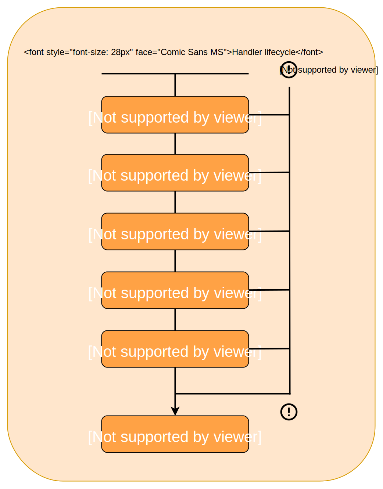

<p align="center">
  <a href="https://github.com/juliantellez/lambcycle" target="_blank">
    
  </a>
</p>

<p align="center">
  Lambcycle is a declarative <a href="https://aws.amazon.com/lambda/" target="_blank">lambda</a> middleware. Its main purpose is to let you focus on the specifics of your application by providing a configuration cycle.
</p>

<!---links--->

<p align="center">
<!---npm--->
<a href="https://www.npmjs.com/package/lambcycle" target="_blank">
    
</a>

<!---npm downloads--->
<a href="https://npmcharts.com/compare/lambcycle?minimal=true" target="_blank">
    
</a>

<!---travis master build--->
<a href="https://travis-ci.org/juliantellez/lambcycle/" target="_blank">
    
</a>

<!---install size--->
<a href="https://packagephobia.now.sh/result?p=lambcycle" target="_blank">
    
</a>

<!---npm dependencies--->
<a href="https://david-dm.org/juliantellez/lambcycle" target="_blank">
    
</a>

<!---npm dev-dependencies--->
<a href="https://david-dm.org/juliantellez/lambcycle?type=dev" target="_blank">
    
</a>

<!---coveralls--->
<a href="https://coveralls.io/github/juliantellez/lambcycle" target="_blank">
    
</a>

<!---npm dependency updates--->
<a href="https://snyk.io/test/github/juliantellez/lambcycle?targetFile=package.json" target="_blank">
    
</a>

<a href="http://www.serverless.com" target="_blank">
    
</a>


<a href="https://opensource.org/licenses/MIT" target="_blank">
    
</a>

</p>

 - [Install](#install)
 - [Introduction](#Introduction)
 - [Handler Lifecycle](#Handler-lifecycle)
 - [Creating a Plugin](#creating-a-plugin)
 - [Using a Plugin](#using-a-plugin)
 - [About the project](#about-the-project)
 - [Contributing](#contributing)
 - [License](#license)

# Install

```bash
# with npm
npm install --save lambcycle

# with yarn
yarn add lambcycle
```

# Introduction

Lambcycle is a middleware for lambda functions. It defines a configurable life-cycle and allows you to focus on your application's logic. It has a "Feature as Plugin" approach, so you can easily create your own plugins or reuse your favorite packages with very little effort 🐑 🛵.

Checkout the following example or follow the link to
[🎉 see some actual code 🎉 ](https://github.com/juliantellez/lambcycle/tree/master/examples).


```javascript
// with es6

import lambcycle, { bodyParser, joi as lambcycleJoi, pino } from "lambcycle";
import Joi from "joi";

import applicationLogic from "./mycode";

const processData = async (event, context) => {
  // beautiful application logic ...

  const manipulateData = event => {
    // ...
  };

  return await applicationLogic(manipulateData(event), context);
};

const schema = Joi.object()
  .keys({
    username: Joi.string().alphanum().min(5).required(),
    password: Joi.string().regex(/^[a-zA-Z0-9]{5,30}$/),
    email: Joi.string().email({ minDomainAtoms: 2 })
  });

const handler = lambcycle(processData).register([
  pino,
  bodyParser,
  lambcycleJoi(schema)
]);

export default handler;
```

# Handler lifecycle

The lifecycle provides a clear guideline to reason about your needs. Every step of the cycle can handle or throw errors making it easy to log, report or debug.




# Creating a plugin 

A plugin is an object that can attach its hooks to one or more event cycles, it may provide its own configuration object.

```typescript
type IPluginHookFunction = (
    wrapper: IWrapper,
    config: object,
    handleError?: Callback
) => void;
```

```typescript
import * as Sentry from '@sentry/node';
import MyAwesomeIntegration from './MyAwesomeIntegration'

const sentryPlugin = (config) => {
    Sentry.init({
        dsn: `https://config.key@sentry.io/${config.project}`,
        integrations: [new MyAwesomeIntegration()]
    });

    return {
        config,
        plugin: {
            onPreResponse: async (handlerWrapper, config) => {
                Sentry.captureMessage('some percentile log perhaps?')
            },
            onError: async (handlerWrapper, config) => {
                Sentry.captureException(handlerWrapper.error);
            }
        }
    }
}

export default sentryPlugin;
```

# Using a plugin

Let's reuse the example above

```typescript
import lambcycle from 'lambcycle'
import sentryPlugin from './sentryPlugin'

const myApplicationLogic = async (event, context) => {
    await someLogic()
}

const handler = lambcycle(myApplicationLogic)
.register([
    sentryPlugin({
        key: process.env.SENTRY_KEY,
        project: process.env.SENTRY_PROJECT,
    })
]);

export default handler;
```

# About the project

# Contributing

# License